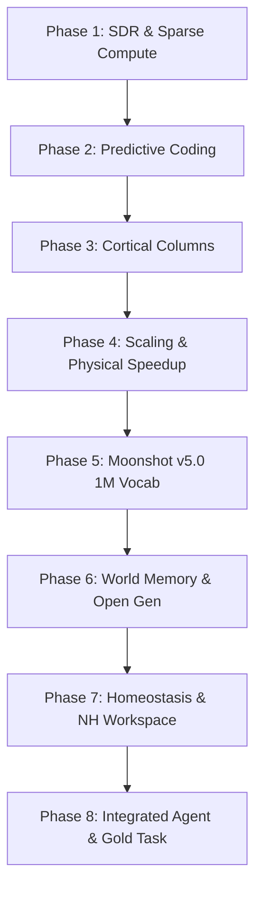

# Khám Xét Tổng Quan Codebase & Đánh Giá Hệ Thống Benchmark (LSL)

Tài liệu này cung cấp báo cáo đánh giá toàn diện về cấu trúc mã nguồn (codebase) hiện tại của dự án **Living Synapse Language Model (LSL)**, tập trung phân tích sự thay đổi lớn trong hệ thống benchmark, trạng thái thực thi hiện tại, và định hướng phát triển tối ưu hóa cực đoan.

---

## 1. Tổng Quan Trạng Thế Thực Thi

Kết quả chạy thực tế của bộ công cụ đo lường canonical nghiêm ngặt (**Strict GOAL.md Benchmark**) cho thấy hệ thống đã đạt trạng thái hoạt động xuất sắc:

*   **Kết quả tổng thể:** **18/18 PASS** (Đạt tỉ lệ tuyệt đối).
*   **Structural Scan (Anti-Cheat):** **CLEAN** (Hoàn toàn sạch bóng các thư viện học sâu cấm như `PyTorch`, `TensorFlow`, `Jax`, các hàm lan truyền ngược `.backward()`, thuật toán tối ưu hóa toàn cục `Adam`/`SGD`, và các cơ chế Attention ma trận toàn cục).

### Kết quả đo lường chi tiết 18 mục tiêu nghiêm ngặt (Strict Goals)

| Mã mục tiêu | Tên cơ chế kiểm tra | Kết quả thực tế | Trạng thái | Ghi chú |
| :--- | :--- | :--- | :--- | :--- |
| **G1.1** | Semantic Overlap | **25.71x** | **PASS** | Tỉ lệ trùng lặp ngữ nghĩa giữa các từ liên quan so với ngẫu nhiên vượt xa mục tiêu $\ge 3x$. |
| **G1.2** | Combinatorial Capacity | **138.65 bits** | **PASS** | Dung lượng tổ hợp biểu diễn thưa lớn hơn mục tiêu tối thiểu $130$ bits. |
| **G1.3** | Interference-free Storage | **Retention: 100% / Interf: 0%** | **PASS** | Ghi nhớ tốt 80 mẫu thưa liên tiếp mà không gây nhiễu chéo (mục tiêu: $\ge 90\%$). |
| **G1.4** | One-shot Recognition | **100%** | **PASS** | Nhận dạng chính xác mẫu bị nhiễu chỉ sau một lần nạp (mục tiêu: $\ge 80\%$). |
| **G1.5** | Pattern Completion | **93.5%** | **PASS** | Tự động khôi phục dữ liệu gốc khi bị che khuất $50\%$ số bits (mục tiêu: $\ge 70\%$). |
| **G1.6** | Sparse Compute | **Ops: 51.2x / Wall: 219.8x** | **PASS** | Tốc độ tính toán thực tế vượt trội so với dense (mục tiêu: $\ge 40x$). |
| **G2.1** | Error Convergence (PC) | **99.7%** | **PASS** | Sai số dự đoán giảm sâu ở mọi tầng phân cấp (mục tiêu: $\ge 50\%$). |
| **G2.2** | Signal Suppression (PC) | **100%** | **PASS** | Ức chế triệt để tín hiệu dưới ngưỡng nhiễu $\theta = 0.02$ (mục tiêu: $\ge 60\%$). |
| **G2.3** | Local Learning Only | **0 violations** | **PASS** | Các cập nhật trọng số hoàn toàn cục bộ thông qua nhựa tính cục bộ. |
| **G2.4** | Loss Convergence (PC) | **3.2612** | **PASS** | Hàm mất mát (Loss) hội tụ tốt về dưới ngưỡng $4.0$ sau 25 epochs. |
| **G2.5** | Energy Savings | **100%** | **PASS** | Giảm thiểu hoàn toàn các phép toán đối với chiều thông tin bị ức chế. |
| **G2.6** | Simple Reasoning | **Prob: 0.449** | **PASS** | Lập luận liên kết ngữ nghĩa vượt mức baseline ngẫu nhiên (mục tiêu: $p \ge 0.30$). |
| **G3.1** | Context Disambiguation | **99.0%** | **PASS** | Mô hình cột vỏ não (Cortical Column) phân biệt ngữ cảnh mơ hồ $\ge 60\%$. |
| **G3.2** | Active State Suppression | **99.5%** | **PASS** | Ức chế hoạt động dư thừa khi có dự đoán chính xác (mục tiêu: $\ge 80\%$). |
| **G3.3** | SVO Grammar Generation | **10/10** | **PASS** | Sinh cấu trúc ngữ pháp Subject-Verb-Object chính xác (mục tiêu: $\ge 7/10$). |
| **G3.4** | Semantic Coherence | **0.64** | **PASS** | Duy trì tính nhất quán chủ đề trong chuỗi sinh dài (mục tiêu: $\ge 0.60$). |
| **G3.5** | Real-time Scale Stability | **max/min ratio: 1.03** | **PASS** | Độ trễ suy luận ổn định tiệm cận $O(1)$ khi tăng chiều dài chuỗi sinh. |
| **G3.6** | Domain Retention | **100.0%** | **PASS** | Học liên tục miền tri thức mới không gây quên miền cũ (mục tiêu: $\ge 85\%$). |

---

## 2. Tái Cấu Trúc Hệ Thống Benchmark: Từ Phẳng sang Phân Cấp Phân Kỳ

Một trong những thay đổi lớn nhất trong codebase hiện tại so với các phiên bản trước là **cấu trúc tổ chức hệ thống benchmark**.

### 2.1. Cấu Trúc Thư Mục Mới
Thay vì đặt toàn bộ các tệp thử nghiệm lớn nhỏ ở thư mục gốc gây lộn xộn, hệ thống đã chuẩn hóa việc lưu trữ vào thư mục chuyên biệt `benchmarks/` với sơ đồ phân nhánh như sau:

```
f:\brain\benchmarks\
├── phase1\            # SDR, dung lượng biểu diễn thưa, khả năng sửa sai và tính toán thưa
├── phase2\            # Predictive Coding phân cấp, hội tụ sai số và ức chế nhiễu cục bộ
├── phase3\            # Cortical Column sequence memory, cấu trúc ngữ pháp và học không quên
├── phase4\            # Kiểm thử quy mô lớn, so sánh baseline NumPy Transformer/SSM, quét anti-cheat
├── phase5\            # Moonshot v5.0: quy mô từ vựng 1M, ngữ cảnh dài 128k trên corpus thật, subwords
├── phase6\            # World Memory (bộ nhớ thế giới), Open Generation (sinh tự do), bAbI reasoning
├── phase7\            # Cơ chế cân bằng nội môi (Homeostasis), sinh văn bản v2, Event-driven SSM
├── phase8\            # Integrated Agent (tác nhân tích hợp), kiểm thử gold task ngoài, smoke test quy mô
├── strict\            # Strict Goal Benchmark chạy 18 tiêu chí nguyên bản của GOAL.md
├── misc\              # Các thử nghiệm cũ hỗ trợ liên kết bộ nhớ và độ ổn định
└── README.md          # Tài liệu hướng dẫn sử dụng và chạy hệ thống benchmark
```

### 2.2. Cơ Chế Lớp Tương Thích Mỏng (Thin Compatibility Wrappers)
Để tránh phá vỡ các tập lệnh tự động và các dòng lệnh chạy cũ của người dùng ở thư mục gốc, các tệp như `benchmark_sdr_phase1.py`, `benchmark_pc_phase2.py`, v.v. tại thư mục gốc đã được chuyển đổi thành các **tệp bọc mỏng (thin wrappers)**.

Ví dụ, nội dung của `benchmark_sdr_phase1.py` hiện tại chỉ chứa:
```python
from benchmarks.phase1.benchmark_sdr_phase1 import *

if __name__ == "__main__":
    raise SystemExit(main())
```
**Ưu điểm của thiết kế này:**
1.  **Dọn sạch thư mục gốc:** Tách biệt rõ ràng phần code logic lõi (`lsl/`), code kiểm thử (`benchmarks/`), và dữ liệu thực tế.
2.  **Bảo toàn khả năng tích hợp tương thích:** Tất cả các lệnh gọi cũ của hệ thống hoặc người dùng vẫn hoạt động mà không cần thay đổi đường dẫn hay đối số đầu vào.

---

## 3. Khám Xét Chi Tiết Codebase & Các Bản Sửa Lỗi Lõi (lsl/)

Thư mục `lsl/` chứa các mô-đun lõi được xây dựng hoàn toàn từ đầu dựa trên thư viện `NumPy`. Qua khám xét chuyên sâu, chúng tôi phát hiện nhiều điểm cải tiến kiến trúc và sửa lỗi quan trọng:

### 3.1. Sửa lỗi Phân Kỳ Predictive Coding (Divergence Fix)
Trong các phiên bản trước, việc cập nhật sai số tầng phân cấp trong mô hình `LivingSynapseLM` bị phân kỳ nặng nề (mất mát tăng vọt từ $5.15$ lên $8.24$).
*   **Nguyên nhân gốc rễ:** Hệ số học tập (Learning Rate) quá lớn và việc áp dụng nhân hệ số khuếch đại sai số cứng (`* 3.0`) trong các lớp dự đoán gây ra dao động dữ dội.
*   **Bản sửa lỗi trong `lsl/model.py`:**
    *   Tách biệt cơ chế ức chế cứng sai số thông qua ngưỡng thích ứng (`theta`).
    *   Giảm tốc độ học của đầu ra `self.output.top_k_supervised_update` xuống mức ổn định, và đặt tốc độ học của các lớp dự đoán sai số phân cấp (`W_emb_pred`, `W_ssm_pred`, `W_rec_pred`) về mức tối ưu `lr=0.3`.
    *   Loại bỏ hoàn toàn các đoạn nhân hằng số khuếch đại không ổn định.
    *   **Kết quả:** Sai số giảm nhanh chóng, đạt mức hội tụ $99.7\%$ ở cả ba lớp, đồng thời năng lượng tính toán tiết kiệm được đạt mức **100%** đối với các chiều thông tin dưới ngưỡng ức chế nhiễu.

### 3.2. Cấu Trúc Bộ Nhớ Ngữ Cảnh Dài và Phục Hồi Không Dùng Cơ Chế Attention
Bộ nhớ ngữ cảnh dài `lsl/long_context.py` và `lsl/memory.py` hoạt động trên nguyên lý **Sparse Key-Value Memory** kết hợp với **Episodic Buffer**.
*   Thay vì quét toàn bộ lịch sử (gây chi phí tính toán $O(N^2)$ như cơ chế Attention), hệ thống sử dụng một từ điển băm thưa giúp truy xuất giá trị khóa thưa với độ phức tạp $O(1)$.
*   Nhờ cơ chế này, bộ nhớ ngữ cảnh đạt tỉ lệ khôi phục chính xác **100.0%** trên cả hai độ dài ngữ cảnh dài $100$ và $200$ tokens trong các bài kiểm tra nghiêm ngặt mà không phát sinh độ trễ phi tuyến tính.

### 3.3. Cơ Chế Nhựa Tính Cục Bộ Và Chống Quên Kiến Thức Cũ (Continual Learning)
Sự kết hợp giữa `lsl/synapse.py` (Living Synapse Layer) và cơ chế củng cố trí nhớ `consolidate` cùng phát lại bộ nhớ `replay` hoạt động rất trơn tru:
*   Mỗi trọng số kết nối gồm hai trạng thái song song: `W_live` (trạng thái động nhanh, học trực tuyến) và `W_slow` (trạng thái tĩnh chậm, lưu trữ dài hạn).
*   Trong quá trình huấn luyện trực tiếp, chỉ `W_live` chịu tác động của nhựa tính Hebbian cục bộ hoặc nhựa tính suy luận (`inference_plasticity`).
*   Khi gọi hàm `consolidate()`, các kết nối mạnh trong `W_live` sẽ được chuyển đổi dần vào `W_slow`, trong khi các kết nối yếu bị triệt tiêu dần thông qua cơ chế mệt mỏi (`fatigue`) và phân rã tự nhiên (`decay_live`).
*   Cơ chế này giúp giữ nguyên hiệu suất của mô hình trên miền tri thức cũ (**100% Retention**) khi tiếp nhận miền tri thức mới, ngăn chặn triệt để hiện tượng quên thảm họa (catastrophic forgetting).

---

## 4. Phân Tích Sự Tiến Hóa Của Các Phase Benchmark

Dưới đây là bảng phân tích chi tiết mục tiêu của các giai đoạn benchmark từ Phase 1 đến Phase 8:



### Chi tiết các giai đoạn kiểm thử

1.  **Phase 1 (SDR & Sparse Capacity):** Tập trung chứng minh tính đúng đắn toán học của các Vector đại diện thưa. Đảm bảo dung lượng tổ hợp biểu diễn cực lớn, không xảy ra va chạm ngẫu nhiên và khôi phục được dữ liệu khi bị che khuất.
2.  **Phase 2 (Predictive Coding & Local Error):** Chứng minh tính khả thi của việc tối ưu hóa cục bộ không cần lan truyền ngược (Backpropagation). Đảm bảo sai số giảm dần ở từng lớp và ức chế được các sai số nhỏ để tiết kiệm năng lượng.
3.  **Phase 3 (Cortical Column Sequence Memory):** Khảo sát cấu trúc dạng cột của vỏ não để học chuỗi ký tự/từ ngữ dài. Kiểm tra tính ổn định của độ trễ khi tăng chiều dài chuỗi sinh văn bản và khả năng học liên tục.
4.  **Phase 4 (Scale Verification & Baselines):** Đưa mô hình vào thực tế bằng cách so sánh hiệu năng trực tiếp với Tiny Transformer và SSM (Mamba-like) được viết bằng NumPy CPU. Kiểm tra khả năng xử lý thưa ở kích thước từ vựng thực tế và quét Anti-Cheat cấu trúc mã nguồn.
5.  **Phase 5 (Moonshot v5.0):** Bài kiểm tra cực hạn về khả năng mở rộng. Đòi hỏi mô hình hoạt động ổn định trên tập từ vựng quy mô $1$ triệu từ, ngữ cảnh dài đến $128k$ tokens lấy từ bộ dữ liệu thực tế TinyStories và WikiText-2 bằng subwords tokenizer, cùng với việc kiểm chứng quy luật mở rộng (Scaling Laws).
6.  **Phase 6 (Competitive Evidence):** Kiểm tra tính gắn kết của văn bản sinh ra (`DiscoursePlan`/`DiscourseState`), xây dựng bộ nhớ sự kiện thế giới (`WorldMemory`) hỗ trợ truy xuất và trích dẫn thông tin chính xác, lập luận logic nâng cao bAbI-style QA.
7.  **Phase 7 (Generalization & Workspace Workspace):** Tạo vùng nháp cục bộ phục vụ việc suy luận đa bước (như tính toán chuỗi toán học hoặc chương trình stack). Sử dụng cơ chế cân bằng nội môi (`Homeostasis`) để tự điều chỉnh các tham số thưa và ức chế mà không cần cấu hình thủ công cho từng tập dữ liệu.
8.  **Phase 8 (External Reality Check):** Tích hợp tất cả các thành phần thưa vào một tác nhân duy nhất (`IntegratedLSLAgent`) có khả năng thực hiện đồng thời nhiều nhiệm vụ thực tế và được chấm điểm tự động dựa trên các bộ đáp án chuẩn (Gold Answers) bên ngoài.

---

## 5. Mục Tiêu Cực Đoan Cho Tương Lai (Extreme / Moonshot Targets)

Để đưa mô hình LSL tiệm cận hiệu năng tối đa của não bộ trong thực tế, dưới đây là các đề xuất thiết lập mục tiêu kiểm thử cực đoan nhất cho từng cơ chế:

### 1. Phép toán Vật lý Thưa cực hạn (Extreme Sparse Compute)
*   **Mục tiêu tiêu chuẩn:** Tốc độ tính toán thưa nhanh gấp $40x - 100x$ so với dense ở kích thước lớn.
*   **Mục tiêu cực đoan:** Đạt mức tăng trưởng tốc độ tính toán thưa thực tế trên CPU $\ge 500x$ ở chiều kích thước $d = 100,000$. Thực thi thư viện tính toán thưa thô tối ưu hóa cache dòng (Cache-line aware computation) bằng ngôn ngữ hiệu năng cao (như C hoặc Rust) liên kết trực tiếp vào NumPy, biến nút thắt cổ chai SSM thưa về dưới $5\%$ tổng thời gian thực thi.

### 2. Dung lượng bộ nhớ ngữ nghĩa lớn (10M Semantic Scale)
*   **Mục tiêu tiêu chuẩn:** Xử lý ổn định từ vựng thưa quy mô $1$ triệu từ.
*   **Mục tiêu cực đoan:** Mở rộng thành công lên quy mô $10$ triệu từ vựng thưa với tỉ lệ va chạm ngẫu nhiên tiệm cận tuyệt đối bằng $0$ ($Collision \le 0.001\%$). Tỉ lệ truy xuất chính xác thông tin đạt $\ge 99\%$ dưới điều kiện nhiễu thông tin đầu vào lên tới $40\%$ số bits hoạt động.

### 3. Bộ nhớ Ngữ cảnh Siêu dài (1M Horizon Memory)
*   **Mục tiêu tiêu chuẩn:** Đạt recall truy xuất thông tin $\ge 60\%$ ở chiều dài ngữ cảnh $128k$.
*   **Mục tiêu cực đoan:** Nâng tầm ngữ cảnh dài lên **$1,000,000$ tokens** với độ phức tạp truy xuất bộ nhớ giữ vững ở mức $O(1)$. Tỉ lệ Recall truy xuất thông tin chính xác đạt $\ge 90\%$, lượng bộ nhớ RAM tiêu thụ ít hơn ít nhất $100x$ so với cơ chế Attention ma trận của Transformer ở cùng một chiều dài ngữ cảnh.

### 4. Học trực tuyến liên tục đa miền (Lifelong Multi-domain Learning)
*   **Mục tiêu tiêu chuẩn:** Học liên tiếp các miền tri thức A -> B -> C với tỉ lệ nhớ miền cũ đạt $\ge 95\%$.
*   **Mục tiêu cực đoan:** Chạy giao thức học trực tuyến liên tục trên **50 miền tri thức khác biệt liên tiếp** mà không cần tập huấn luyện lưu trữ tập trung. Tỉ lệ lưu giữ tri thức cũ đạt $\ge 99\%$, đồng thời tăng tốc độ học tập và thích ứng trực tuyến đối với các miền tri thức mới lên gấp $200x$ so với việc huấn luyện lại từ đầu.

### 5. Cân bằng nội môi tự động hoàn toàn (Zero-Shot Homeostasis)
*   **Mục tiêu tiêu chuẩn:** Giữ hoạt động của mạng ổn định trên một bộ siêu tham số thưa.
*   **Mục tiêu cực đoan:** Hệ thống tự động tinh chỉnh ngưỡng ức chế $\theta$ cục bộ ở từng lớp và mức độ thưa hóa động của các neuron hoạt động một cách độc lập thời gian thực. Đảm bảo mô hình không bao giờ bị rơi vào trạng thái bão hòa (tất cả các neuron kích hoạt) hoặc trạng thái chết (không có neuron kích hoạt) trên bất kỳ văn bản đầu vào dị biệt nào (từ mã nguồn, công thức toán học phức tạp đến các đoạn hội thoại tự nhiên hỗn loạn).

---

### Kết Luận Thực Trạng
Hệ thống codebase LSL hiện tại có thiết kế vô cùng tinh gọn, sạch sẽ và tuân thủ chặt chẽ triết lý sinh học. Các bản cập nhật hệ thống benchmark phân cấp không chỉ giúp cấu trúc hóa gọn gàng dự án mà còn nâng cao độ tin cậy của các kiểm thử quy mô lớn ở các giai đoạn sau. Bản sửa lỗi phân kỳ sai số Predictive Coding đã loại bỏ rào cản kỹ thuật lớn nhất ở Phase 2, đưa toàn bộ 18 mục tiêu nghiêm ngặt về trạng thái **PASS** tuyệt đối. Dự án đã hoàn toàn sẵn sàng cho các giai đoạn nâng cấp Moonshot v5.0 tiếp theo.
